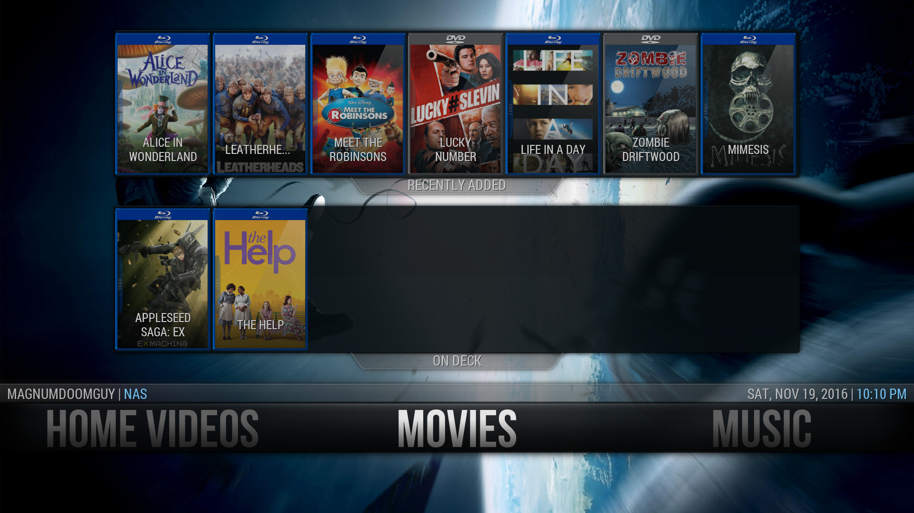
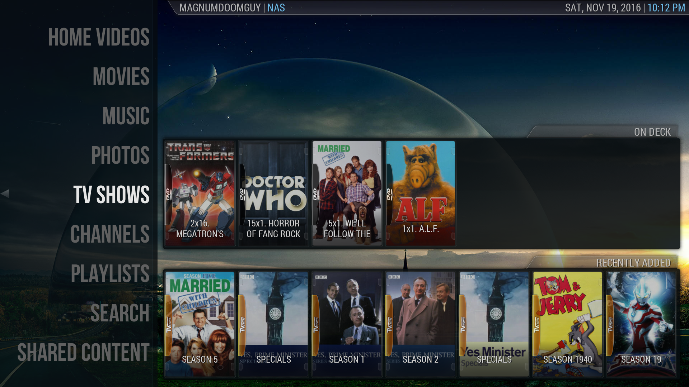
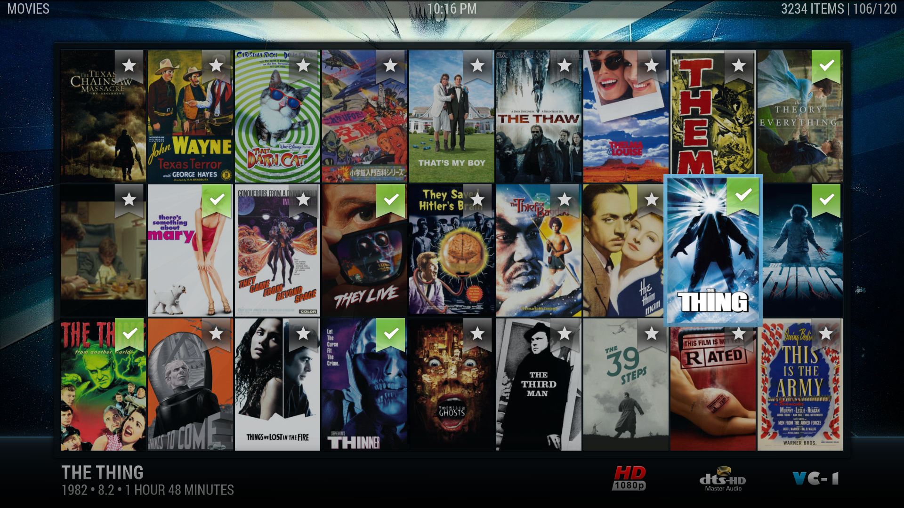
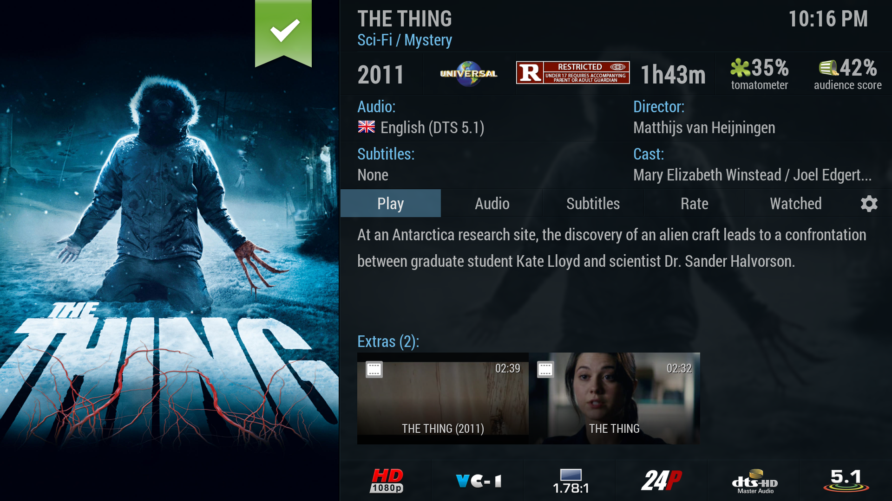
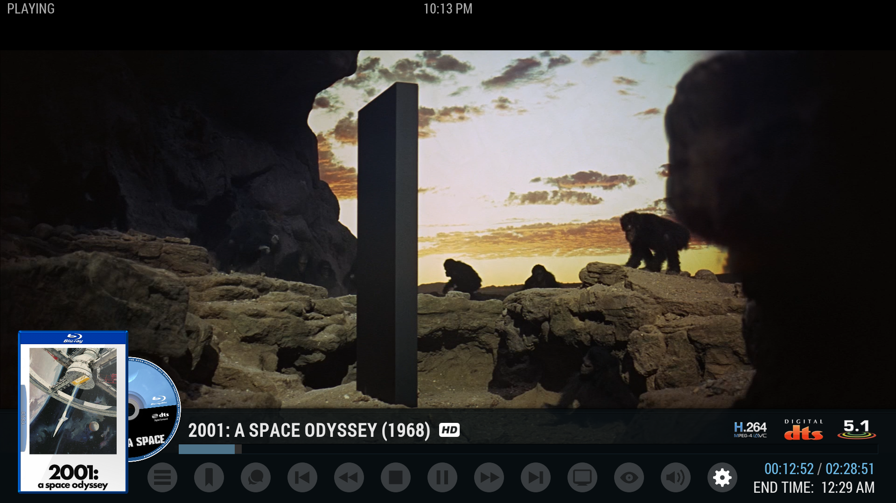

<h1>Aeon Nox 5 for OpenPHT</h1>

I'm very pleased to announce the release of my port of the Aeon Nox 5 from Kodi for Plex Home Theater.

Aeon Nox 5 has 28 different viewtypes, an intuitive and graceful GUI and lots of configuration options.

<h2>Installation:</h2>

OpenPHT now supports automatic installation of Aeon Nox 5 from within the application itself.

<h2>Screenshots:</h2>

<h2>Credits:</h2>

<ul>
  <li>Bignoid for creating Aeon Nox 5 for Kodi</li>
  <li>mikesilvo164 for Aeon Nox Silvo</li>
  <li>kwiboo for all his hardwork on OpenPHT and his help with Aeon Nox</li>
  <li>bkury for his hardwork on OpenPHT and adding so many cool skinning features to OpenPHT, and for his Night skin which has been a valuable resource for picking apart the OpenPHT skinning engine</li>
  <li>Steveb for the Fanartlist, BannerInfo and Shiftcase viewtypes</li>
  <li>Warner306 for the Small Icons viewtype</li>
  <li>manfeed for the simulated discart, Music mods and Shelf 3D Viewtype</li>
  <li>SeedyEvil for the Now Playing mod</li>
  <li>schimi2k (RIP) for media flags</li>
  <li>Mr. V for the homemenu widgets</li>
  <li>neurosis13 for the color media flags</li>
  <li>newyears1978 for the icons he made for Aeon Nox</li>
  <li>Tgx for fanart from his Black Glass Nova skin</li>
  <li>Aeon MQ for fanart</li>
  <li>frodo19 for the Aeon Nox Genre Icon template</li>
  <li>TBinfection for the Genre fanart</li>
  <li>Metropolis for some of the OSD options</li>
  <li>bugatsinho for the Greek translation</li>
  <li>danichispa for the Spanish translation</li>
  <li>sebastianklein for the German translation</li>
  <li>aeronnl and FREAKJAM for the Dutch translation</li>
  <li>aeronnl, FREAKJAM, nedthenerd, dlanor and dan-the-man for testing</li>
  </li>Extra special thanks to i/o for his help during the early stages of this project.</li>
</ul>
